# Diagrama Bloc - Sistem de Control Semafor Intersecție

## Arhitectura Circuitului

Sistemul este organizat ierarhic cu **un modul orchestrator** care controlează **patru module de direcție**.

```mermaid
graph TB
    subgraph "Semaforul Intersectiei"
        TOP["semafor_intersectie<br/>(Orchestrator)"]
    end
    
    subgraph "4 Module Directii"
        N["semafor_directie<br/>NORD<br/>C_VERDE=28s"]
        S["semafor_directie<br/>SUD<br/>C_VERDE=26s"]
        E["semafor_directie<br/>EST<br/>C_VERDE=15s"]
        V["semafor_directie<br/>VEST<br/>C_VERDE=29s"]
    end
    
    subgraph "Intrari comune"
        CLK["clk_i<br/>10 MHz"]
        RST["reset_n_i"]
        SRV["service_i"]
        BTN["pietoni_btn_i"]
    end
    
    subgraph "Iesiri Nord"
        RN["rosu_auto_N_o"]
        GN["galben_auto_N_o"]
        VN["verde_auto_N_o"]
        PN_R["rosu_pietoni_N_o"]
        PN_V["verde_pietoni_N_o"]
    end
    
    subgraph "Iesiri Sud"
        RS["rosu_auto_S_o"]
        GS["galben_auto_S_o"]
        VS["verde_auto_S_o"]
        PS_R["rosu_pietoni_S_o"]
        PS_V["verde_pietoni_S_o"]
    end
    
    subgraph "Iesiri Est"
        RE["rosu_auto_E_o"]
        GE["galben_auto_E_o"]
        VE["verde_auto_E_o"]
        PE_R["rosu_pietoni_E_o"]
        PE_V["verde_pietoni_E_o"]
    end
    
    subgraph "Iesiri Vest"
        RV["rosu_auto_V_o"]
        GV["galben_auto_V_o"]
        VV["verde_auto_V_o"]
        PV_R["rosu_pietoni_V_o"]
        PV_V["verde_pietoni_V_o"]
    end
    
    TOP --> N
    TOP --> S
    TOP --> E
    TOP --> V
    
    CLK --> TOP
    RST --> TOP
    SRV --> TOP
    BTN --> TOP
    
    CLK --> N
    RST --> N
    SRV --> N
    BTN --> N
    
    CLK --> S
    RST --> S
    SRV --> S
    BTN --> S
    
    CLK --> E
    RST --> E
    SRV --> E
    BTN --> E
    
    CLK --> V
    RST --> V
    SRV --> V
    BTN --> V
    
    N --> RN
    N --> GN
    N --> VN
    N --> PN_R
    N --> PN_V
    
    S --> RS
    S --> GS
    S --> VS
    S --> PS_R
    S --> PS_V
    
    E --> RE
    E --> GE
    E --> VE
    E --> PE_R
    E --> PE_V
    
    V --> RV
    V --> GV
    V --> VV
    V --> PV_R
    V --> PV_V
```



## Descriere Componente

### Modul Top-Level: `semafor_intersectie`
- **Responsabilitate:** Orchestrare și sincronizare a celor 4 direcții
- **Intrări Comune:**
  - `clk_i` - Ceas 10 MHz
  - `reset_n_i` - Reset asincron
  - `service_i` - Mod de avarie
  - `pietoni_btn_i` - Buton cerere traversare (comun pentru toate direcțiile)

### Module Subordinate: `semafor_directie` (×4)
- **Nord:** Durata verde = 28 secunde
- **Sud:** Durata verde = 26 secunde
- **Est:** Durata verde = 15 secunde
- **Vest:** Durata verde = 29 secunde

Fiecare modul produce:
- 3 semnale auto: Roșu, Galben, Verde
- 2 semnale pietoni: Roșu, Verde
- 1 semnal de finalizare: `secventa_incheiata_o`

## Flux de Date

```
┌─ INTRĂRI GLOBALE ─────────────────────────┐
│ clk_i (10 MHz)                           │
│ reset_n_i (activ pe 0)                   │
│ service_i (mod avarie)                   │
│ pietoni_btn_i (buton common)             │
└──────────────────┬────────────────────────┘
                   │
                   ▼
        ┌──────────────────────┐
        │ semafor_intersectie  │ (Orchestrator)
        │                      │
        │ Secvență: S→E→V→N   │
        └──────────┬───────────┘
                   │
        ┌──────────┴──────────┬──────────┬──────────┐
        ▼                     ▼          ▼          ▼
    ┌──────────┐          ┌──────────┐ ┌──────────┐ ┌──────────┐
    │  NORD    │          │   SUD    │ │   EST    │ │  VEST    │
    │  28s     │          │  26s     │ │  15s     │ │  29s     │
    └────┬─────┘          └────┬─────┘ └────┬─────┘ └────┬─────┘
         │                     │            │            │
         ├─ Roșu Auto ────► Intersecție
         ├─ Galben Auto   │
         ├─ Verde Auto    │
         ├─ Roșu Pietoni  │
         └─ Verde Pietoni ─
```

## Semnale Interne de Control

```
semafor_intersectie genereaza:
├── start_N, start_S, start_E, start_V
│   └─ Semnale pentru pornirea fiecărei direcții
│
└── done_N, done_S, done_E, done_V (feedback)
    └─ Indicatori de finalizare ciclu
```

---

**Generată:** Aprilie 2026  
**Varianta:** Proiect CLP - Semafoare Intersecție - Varianta 11
