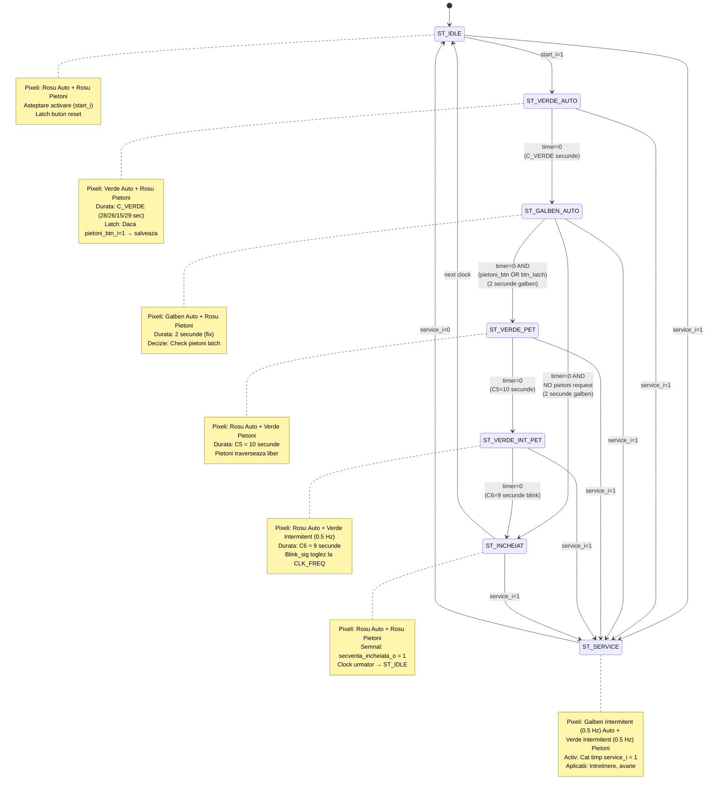

# Diagrama Stărilor FSM - Modul `semafor_directie`

## Mașina de Stări - „Controlul unei Direcții"



## Descriere Detaliată a Stărilor

### 1. **ST_IDLE** - Stare Inactivă
- **Ieșiri:** `rosu_auto_o=1`, `rosu_pietoni_o=1` (stare sigură)
- **Acțion:** Resetare btn_latch
- **Tranziție:** 
  - `start_i=1` → ST_VERDE_AUTO
  - `service_i=1` → ST_SERVICE

### 2. **ST_VERDE_AUTO** - Verde pentru Mașini
- **Ieșiri:** `verde_auto_o=1`, `rosu_pietoni_o=1`
- **Durata Timer:** C_VERDE secunde
  - Nord: 28s
  - Sud: 26s
  - Est: 15s
  - Vest: 29s
- **Acțion:** Latching buton pietoni (`btn_latch = pietoni_btn_i`)
- **Tranziție:** Timer expira → ST_GALBEN_AUTO

### 3. **ST_GALBEN_AUTO** - Galben pentru Mașini (Avertizare)
- **Ieșiri:** `galben_auto_o=1`, `rosu_pietoni_o=1`
- **Durata Timer:** 2 secunde (fix pentru toate direcțiile)
- **Logică Decizion:**
  ```verilog
  if (btn_latch || pietoni_btn_i)
    next_state = ST_VERDE_PET;
  else
    next_state = ST_INCHEIAT;
  ```
- **Tranziție:** Timer expira + check pietoni

### 4. **ST_VERDE_PET** - Verde pentru Pietoni
- **Ieșiri:** `rosu_auto_o=1`, `verde_pietoni_o=1`
- **Durata Timer:** C5 = 10 secunde (constant)
- **Descriere:** Pietoni traversează în timp ce mașinile stau pe roșu
- **Tranziție:** Timer expira → ST_VERDE_INT_PET

### 5. **ST_VERDE_INT_PET** - Verde Intermitent pentru Pietoni
- **Ieșiri:** `rosu_auto_o=1`, `verde_pietoni_o=blink_sig` (0.5 Hz)
- **Durata Timer:** C6 = 9 secunde
- **Descriere:** Clipire (blink) pentru avertizare finale traversare
- **Frecvență Blink:** $f = 0.5 \text{ Hz}$ (toggle la 1 sec, 500 ms HIGH/LOW)
- **Tranziție:** Timer expira → ST_INCHEIAT

### 6. **ST_INCHEIAT** - Secvență Completă
- **Ieșiri:** `rosu_auto_o=1`, `rosu_pietoni_o=1`, `secventa_incheiata_o=1`
- **Durata:** 1 ciclu ceas
- **Semnal de Feedback:** `secventa_incheiata_o=1` indică orchestrator că ciclu s-a terminat
- **Tranziție:** Clock următor → ST_IDLE (automată)

### 7. **ST_SERVICE** - Mod de Avarie/Intretinere
- **Ieșiri:** 
  - `galben_auto_o=blink_sig` (0.5 Hz)
  - `verde_pietoni_o=blink_sig` (0.5 Hz)
- **Descriere:** Galben intermitent pe mașini + Verde intermitent pe pietoni
- **Aplicații:**
  - Intretinere semafor
  - Situații de avarie
  - Mod manual
- **Ieșire:** Nici o progresie de stare (locked in SERVICE)
- **Tranziție:** `service_i=0` → ST_IDLE

## Ecuații Temporizare

```
T_VERDE_AUTO = C_VERDE × CLK_FREQ = C_VERDE × 10_000_000

Unde:
  C_VERDE = durată în secunde (28, 26, 15, 29)
  CLK_FREQ = 10 MHz = 10^7 Hz
  
Pentru varianta 11:
  T_VERDE_N  = 28 × 10^7 = 280,000,000 cicli
  T_VERDE_S  = 26 × 10^7 = 260,000,000 cicli
  T_VERDE_E  = 15 × 10^7 = 150,000,000 cicli
  T_VERDE_V  = 29 × 10^7 = 290,000,000 cicli
  
  T_GALBEN   = 2 × 10^7 = 20,000,000 cicli
  T_VERDE_PET = 10 × 10^7 = 100,000,000 cicli
  T_VERDE_INT_PET = 9 × 10^7 = 90,000,000 cicli
  
  T_BLINK    = CLK_FREQ = 10^7 cicli → 1 sec
              (toggle la fiecare 0.5 sec)
```

## Matricea Tranziției de Stări

| Stare Curentă | Intrare | Stare Următoare |
|---------------|---------|-----------------|
| ST_IDLE | start_i=1 | ST_VERDE_AUTO |
| ST_IDLE | service_i=1 | ST_SERVICE |
| ST_VERDE_AUTO | timer=0 | ST_GALBEN_AUTO |
| ST_VERDE_AUTO | service_i=1 | ST_SERVICE |
| ST_GALBEN_AUTO | timer=0, pietoni=1 | ST_VERDE_PET |
| ST_GALBEN_AUTO | timer=0, pietoni=0 | ST_INCHEIAT |
| ST_GALBEN_AUTO | service_i=1 | ST_SERVICE |
| ST_VERDE_PET | timer=0 | ST_VERDE_INT_PET |
| ST_VERDE_PET | service_i=1 | ST_SERVICE |
| ST_VERDE_INT_PET | timer=0 | ST_INCHEIAT |
| ST_VERDE_INT_PET | service_i=1 | ST_SERVICE |
| ST_INCHEIAT | (clock) | ST_IDLE |
| ST_INCHEIAT | service_i=1 | ST_SERVICE |
| ST_SERVICE | service_i=0 | ST_IDLE |

## Latch Buffer Pietoni

```verilog
always @(posedge clk_i or negedge reset_n_i) begin
    if (!reset_n_i)
        btn_latch <= 0;
    else if (state == ST_INCHEIAT || state == ST_IDLE)
        btn_latch <= 0;  // Reset latch
    else
        btn_latch <= btn_latch || pietoni_btn_i;  // Latch on any HIGH
end
```

Scopul: Dacă pietoni apasă buton oriunde în ST_VERDE_AUTO, cererea este salvată și procesată în ST_GALBEN_AUTO→ST_VERDE_PET.

---

**Generată:** Aprilie 2026  
**Modul:** semafor_directie  
**Varianta:** 11
