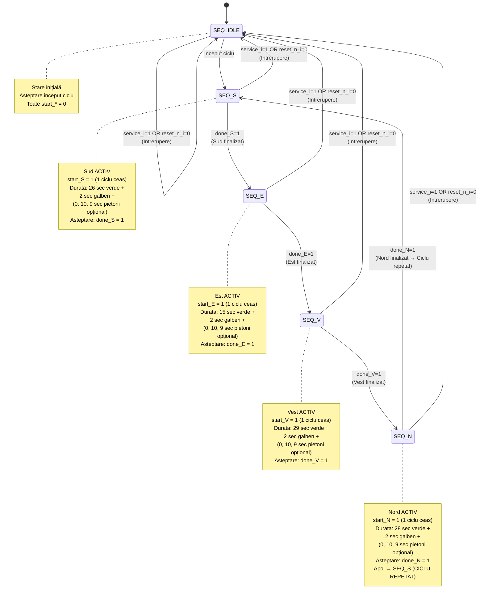

# Diagrama Orchestrator - Modulul `semafor_intersectie`

## Mașina de Stări - Secvență Globală



## Fluxul de Secvență - Varianta 11

```
┌─────────────────────────────────────────────────────────────────┐
│           CICLU COMPLET: S → E → V → N → S → ...              │
└─────────────────────────────────────────────────────────────────┘

┌─── SUD (26s) ────┬─── EST (15s) ────┬─── VEST (29s) ──┬─ NORD (28s) ┐
│  Verde: 26s     │  Verde: 15s      │  Verde: 29s     │ Verde: 28s  │
│  Galben: 2s     │  Galben: 2s      │  Galben: 2s     │ Galben: 2s  │
│  Pietoni: 0/19s │  Pietoni: 0/19s  │  Pietoni: 0/19s │ Pietoni: ... │
├─────────────────┼──────────────────┼─────────────────┼─────────────┤
│ Total: 28-47s   │ Total: 17-36s    │ Total: 31-50s   │ Total: 30-49│
└─────────────────┴──────────────────┴─────────────────┴─────────────┘
        ↓                  ↓                 ↓                  ↓
     done_S=1          done_E=1          done_V=1          done_N=1
        │                  │                 │                  │
        └──────────────────┴─────────────────┴──────────────────┘
                           Ciclul se repetă
```

## Semnale de Control

### Semnale Interne (Generați de FSM)

```
start_N  [1 bit]  ─── Activ 1 ciclu când Nord trebuie sa inceapa
start_S  [1 bit]  ─── Activ 1 ciclu când Sud trebuie sa inceapa
start_E  [1 bit]  ─── Activ 1 ciclu când Est trebuie sa inceapa
start_V  [1 bit]  ─── Activ 1 ciclu când Vest trebuie sa inceapa

done_N   [1 bit]  ──◄ Semnal feedback: Nord finalizat (din inst_nord.secventa_incheiata_o)
done_S   [1 bit]  ──◄ Semnal feedback: Sud finalizat
done_E   [1 bit]  ──◄ Semnal feedback: Est finalizat
done_V   [1 bit]  ──◄ Semnal feedback: Vest finalizat
```

### Semnale Transit (Transmise la Module)

```
Din Orchestrator → La fiecare modul semafor_directie:
├── clk_i              (Clock 10 MHz - COMUN)
├── reset_n_i          (Reset - COMUN)
├── service_i          (Mod avarie - COMUN)
├── start_i            (Diferit per modul: start_N, start_S, etc.)
└── pietoni_btn_i      (Buton pietoni - COMUN)
```

## Diagrama Timing - Secvență Completă

```
CICLU COMPLET (FĂRĂ PIETONI):

t=0     ┌─ SUD ACTIV ──┐
        │              │ start_S=1
        │ Verde: 26s   │ ↓
        │ Galben: 2s  │◄────────── 26,000,000 + 2,000,000 = 28,000,000 cicli
        └──────────────┘ done_S=1

t=28M   ┌─ EST ACTIV ──┐
        │              │ start_E=1
        │ Verde: 15s   │ ↓
        │ Galben: 2s   │◄────────── 15,000,000 + 2,000,000 = 17,000,000 cicli
        └──────────────┘ done_E=1

t=45M   ┌─ VEST ACTIV ─┐
        │              │ start_V=1
        │ Verde: 29s   │ ↓
        │ Galben: 2s   │◄────────── 29,000,000 + 2,000,000 = 31,000,000 cicli
        └──────────────┘ done_V=1

t=76M   ┌─ NORD ACTIV ─┐
        │              │ start_N=1
        │ Verde: 28s   │ ↓
        │ Galben: 2s   │◄────────── 28,000,000 + 2,000,000 = 30,000,000 cicli
        └──────────────┘ done_N=1

t=106M  ┌─ SUD ACTIV AGAIN ┐
        │                  │ (Ciclu repetat)
        ...                ...
```

**Total ciclu (fără pietoni):** 28 + 17 + 31 + 30 = **106 milioane cicli** ≈ **10.6 secunde de simulare reală**

## Logică FSM - Pseudo-Cod

```verilog
always @(posedge clk_i or negedge reset_n_i) begin
    if (!reset_n_i) begin
        seq_state <= SEQ_IDLE;
        start_N <= 0;
        start_S <= 0;
        start_E <= 0;
        start_V <= 0;
    end else if (service_i) begin
        seq_state <= SEQ_IDLE;
        // All starts to 0
    end else begin
        // Default: clear start pulses (1 cycle only)
        start_N <= 0;
        start_S <= 0;
        start_E <= 0;
        start_V <= 0;
        
        case (seq_state)
            SEQ_IDLE: begin
                start_S <= 1;       // START SUD
                seq_state <= SEQ_S;
            end
            
            SEQ_S: begin
                if (done_S) begin
                    start_E <= 1;   // START EST
                    seq_state <= SEQ_E;
                end
            end
            
            SEQ_E: begin
                if (done_E) begin
                    start_V <= 1;   // START VEST
                    seq_state <= SEQ_V;
                end
            end
            
            SEQ_V: begin
                if (done_V) begin
                    start_N <= 1;   // START NORD
                    seq_state <= SEQ_N;
                end
            end
            
            SEQ_N: begin
                if (done_N) begin
                    start_S <= 1;   // RESTART SUD
                    seq_state <= SEQ_S;
                end
            end
            
            default: seq_state <= SEQ_IDLE;
        endcase
    end
end
```

## Scenarii Speciale

### 1. Reset în Timp de Funcționare
```
SEQ_S activ (durant verde Sud)
↓
reset_n_i = 0 (pulse)
↓
seq_state → SEQ_IDLE
start_* → 0 (toate)
↓
Modulele semafor_directie revin la ST_IDLE (rosu-rosu)
```

### 2. Service Mode Activare
```
Oricare stare (SEQ_S, SEQ_E, etc.)
↓
service_i = 1
↓
seq_state → SEQ_IDLE
start_* → 0
↓
Fiecare modul → ST_SERVICE (galben intermitent + verde intermitent pietoni)
```

### 3. Distribuția Butonului Pietoni
```
pietoni_btn_i este COMUN pentru toate 4 direcțiile
↓
Fiecare modul semafor_directie are latch-ul propriu
↓
Dacă apăs buton cât Sud este verde:
  - btn_latch_Sud = 1
  - btn_latch_E = 0
  - btn_latch_V = 0
  - btn_latch_N = 0
(Doar Sud va oferi verde pietoni, altele ignoră)
```

## Parametri Varianta 11 - Tabel Ciclu

| Stare | Direcție | Verde (s) | Galben (s) | Pietoni (s) | Total (M cicli) |
|-------|----------|-----------|-----------|-------------|-----------------|
| SEQ_S | Sud | 26 | 2 | 0-19 | 28-47 |
| SEQ_E | Est | 15 | 2 | 0-19 | 17-36 |
| SEQ_V | Vest | 29 | 2 | 0-19 | 31-50 |
| SEQ_N | Nord | 28 | 2 | 0-19 | 30-49 |
| **TOTAL CICLU** | - | **98** | **8** | **0-76** | **106-188** |

---

**Generată:** Aprilie 2026  
**Modul:** semafor_intersectie  
**Nivel:** Top-Level Orchestrator  
**Varianta:** 11
